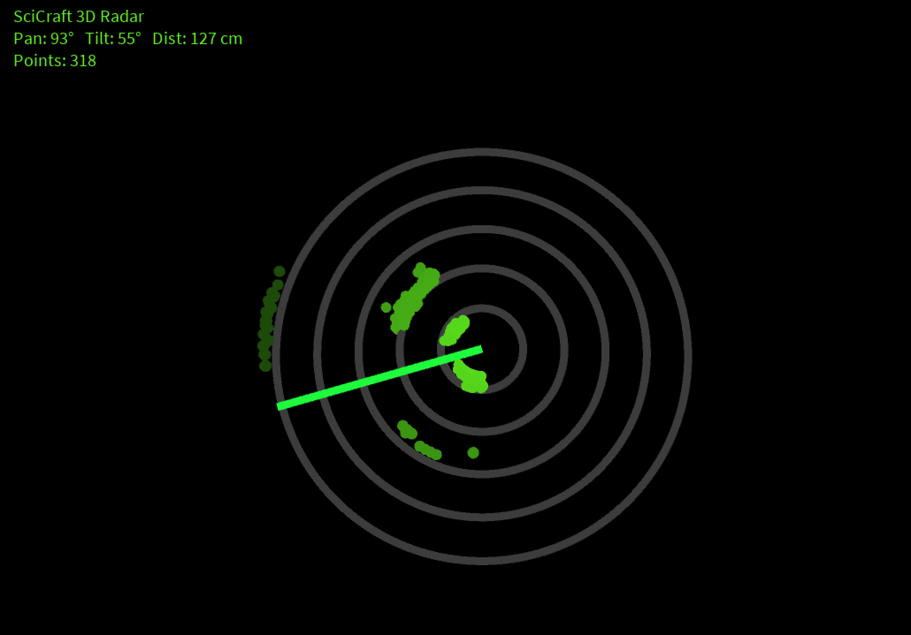
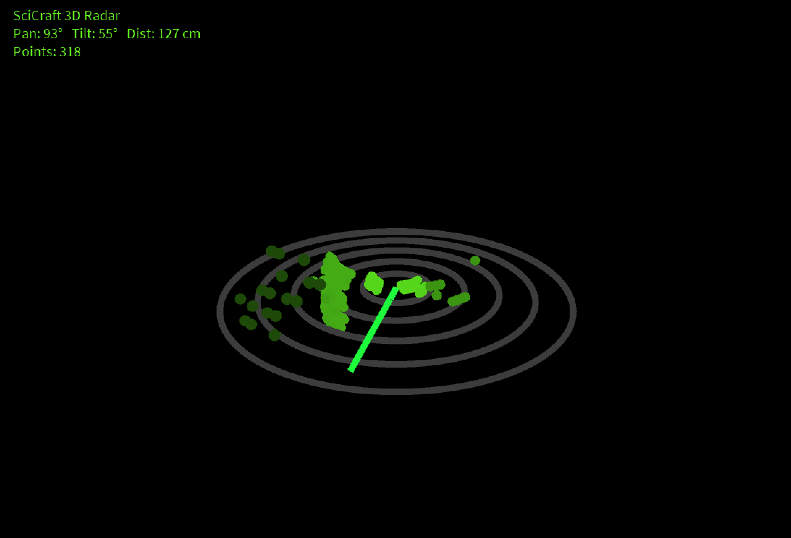
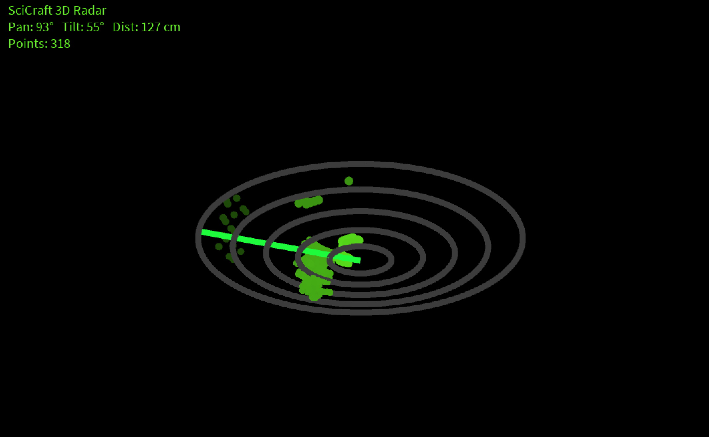
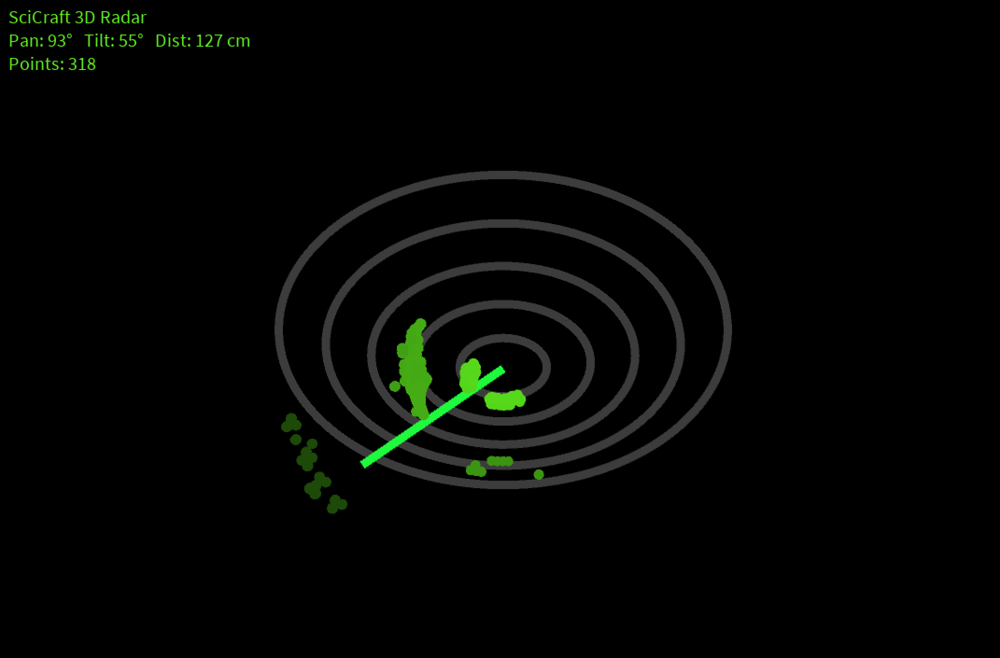
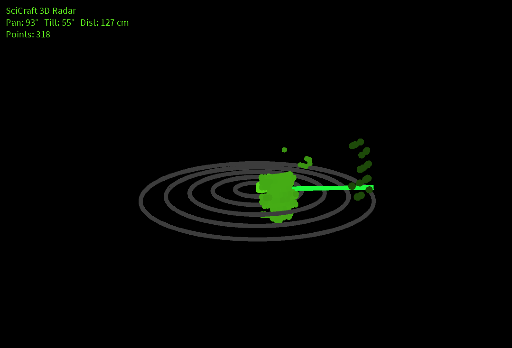

# 3D Radar
A pan/tilt ultrasonic radar built with an Arduino Uno, an ultrasonic HC-SR04 sensor and two servo motors. The project is visualized in real time as a 3D point cloud using Processing.

This project is an extension of the 2D Radar i built (see repo). The difference is that instead of sweeping left-right along one flat plane, the sensor in the 3D radar sweeps both pan (left/right) and tilt (up/down), building up a 3D map of the surfaces and objects in front of it, within 100cm (you can change this range).


## Demo


its a little hard to see here, but when the sensor detects objects/surfaces in front of it, it maps these green points in the 3D view. As you can see when i moved the bottle, more green points appeared in that position (in the top left of the black screen). The the more saturated the green points are in 3D view, the closer they are in real life. 

Below you can see some photos of how the mapping turned out. notice how the green points are dimmer the farther out they are. This is visualized with Processing.

<p float="left">
  
   
  
  
  
</p>


## Project outline

1. Arduino drives two servos motors. One for pan, one for tilt. They move the ultrasonic sensor through a grid of angles. At each position, it triggers the ultrasonic sensor and measures the echo return time to calculate distance.
2. Each reading (pan angle, tilt angle, distance) is sent over serial to a computer running Processing.
3. Processing converts each reading from spherical coordinates (angle + angle + distance) into a 3D (x, y, z) point using basic trigonometry, and adds it to a point cloud.
4. The point cloud is rendered in real time in a 3D window you can orbit and zoom around with the mouse, with closer points being brighter and farther points dimmer.

## Hardware

- Arduino Uno (or compatible)
- HC-SR04 ultrasonic sensor
- 2x servo motors (e.g. SG90 or similar). one for pan, one for tilt, mounted on a pan/tilt bracket with the HC-SR04 attached on top
- Breadboard + jumper wires
- External power supply for the servos. i used 4 AA batteries. 5v is sufficient. You need this because the servos can draw more current than the Arduino's 5V pin or usb port can reliably supply.

### Wiring

| Component | Arduino Pin |
|---|---|
| HC-SR04 Trig | 9 |
| HC-SR04 Echo | 8 |
| Pan servo signal | 10 |
| Tilt servo signal | 11 |
| HC-SR04 VCC | 5V |
| HC-SR04 GND | GND (common ground with Arduino) |

 

The schematics is also available as a pdf in the schematics folder. 

**Note** In the wiring diagram it looks like only one AA battery was used, but you need 4 in this project to supply enough power. Tinkercad didnt have an option for 4

## Software Requirements

- [Arduino IDE](https://www.arduino.cc/en/software) (or any IDE that works with the board you're using)
- [Processing](https://processing.org/download) (3.x or later)

## Setup

### 1. Upload the Arduino code

1. Open arduino/Radar3D/Radar3D.ino in the Arduino IDE.
2. Select **Tools → Board → Arduino AVR Boards → Arduino Uno** (or your specific board).
3. Select **Tools → Port** and choose the port your Arduino is connected to.
4. Compile and upload the code.

### 2. Run the Processing code

1. Open processing/Radar3D/Radar3D.pde in Processing.
2. Change 'portName' in the code to match the port you are using:

   ```java
   String portName = "/dev/cu.usbmodem1101"; // replace with your port
   ```

5. Run the sketch. You should see the pan/tilt sweep begin and points start filling in a 3D window.

## Configuration

Both sketches expose a few parameters worth tuning for your setup:

**Arduino (`Radar3D.ino`)**

| Variable | Description |
|---|---|
| `panMin`, `panMax` | Horizontal sweep range (degrees) |
| `tiltMin`, `tiltMax` | Vertical sweep range (degrees) |
| `panStep`, `tiltStep` | Angular resolution: smaller = more detail, slower scan |

**Processing (`Radar3D.pde`)**

| Variable | Description |
|---|---|
| `maxRangeCm` | Maximum distance (cm) to plot: readings beyond this are ignored |
| `MAX_POINTS` | How many points stay in the cloud before old ones are dropped |
| `levelTilt` | The tilt angle treated as "straight ahead" (horizontal) |

> Keep `panMin`/`panMax`/`tiltMin`/`tiltMax` in sync between both the arduino and processing codes. Processing uses them to convert angles into 3D coordinates correctly.

## Notes on range and accuracy

- The HC-SR04's practical reliable range is roughly 2cm–400cm. So you can choose which range you want within this.
- Flat, hard surfaces reflect sound well and give clean readings. Thin, soft, or angled objects can produce sparse or missing points.
- A flat surface directly facing the sensor at a constant distance will appear as a smooth *curved* sheet in the point cloud. this is expected, since distance is measured radially from the sensor, not as a flat plane.

## License

<!-- Add your license here, e.g. MIT -->
